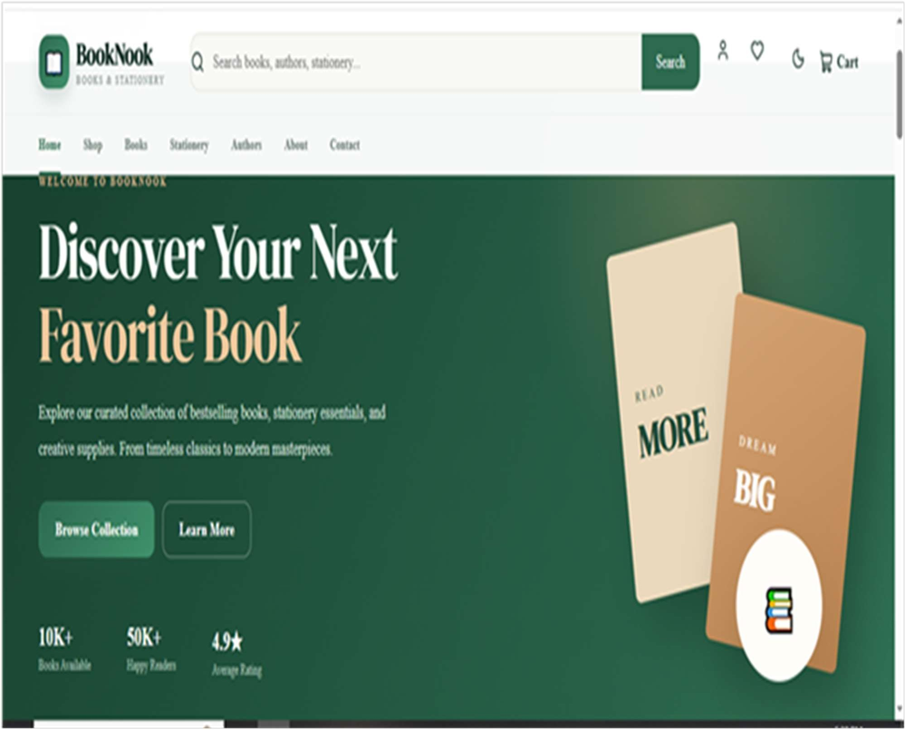
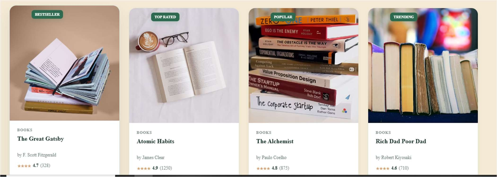
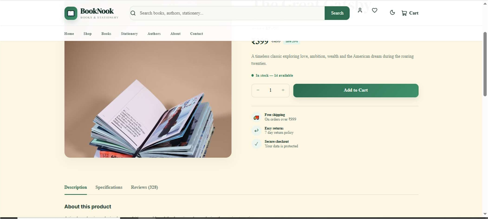
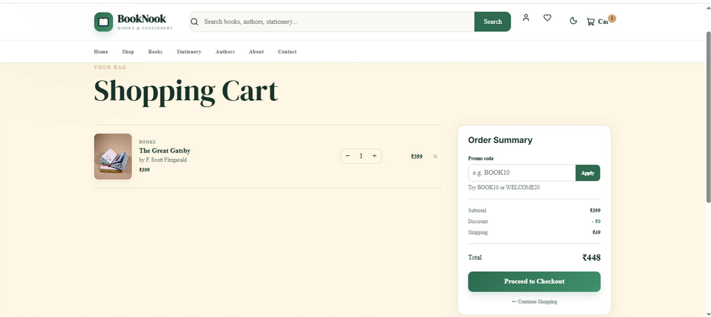
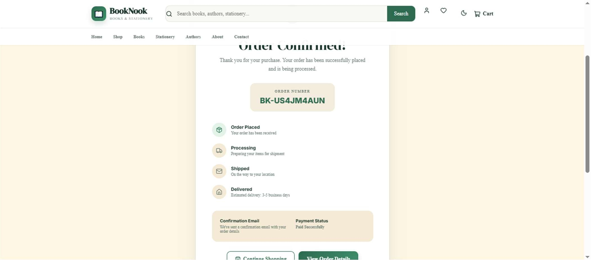
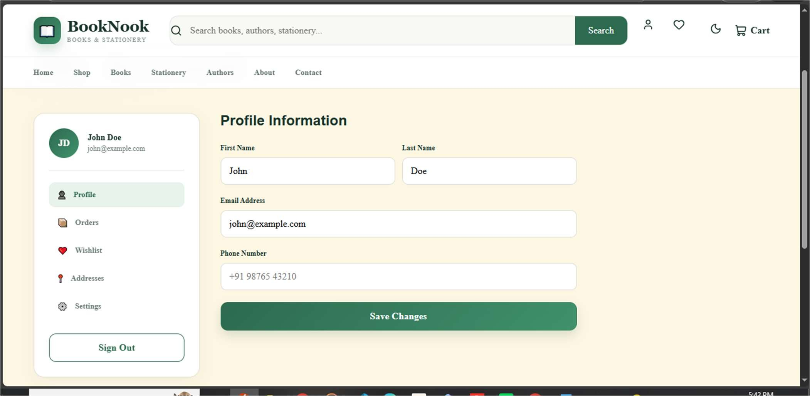

# BookNook – Books & Stationery

> A modern frontend e-commerce website for books and stationery, built with React.js.

**Frontend E-Commerce Web Application**

<p align="left">
  <a href="https://booknook-books.onrender.com/"></a>
  <a href="https://github.com/isakbk/booknook-books.git"></a>
  <a href="https://youtu.be/GZcW2A2KTtw"></a>
</p>

## 🔗 Project Links

| Resource | Link |
|---|---|
| 🌐 Live Website | [https://booknook-books.onrender.com/](https://booknook-books.onrender.com/) |
| 💻 GitHub Repository | [https://github.com/isakbk/booknook-books.git](https://github.com/isakbk/booknook-books.git) |
| ▶️ YouTube Demo | [https://youtu.be/GZcW2A2KTtw](https://youtu.be/GZcW2A2KTtw) |

## 📖 About

BookNook provides book discovery, category browsing, search, product details, cart and checkout flows, user accounts, wishlist, author pages and review features. Client-side state and localStorage simulate persistence without a backend.

## ✨ Features

- **Home** – hero, featured categories, best sellers, new arrivals, top-rated and stationery highlights
- **Shop / Catalog** – search, category, price/rating filters and sorting
- **Product details** – images, info, price, stock, quantity, cart and wishlist
- **Cart** – quantity controls, item removal, promo codes, discount/shipping and total
- **Checkout** – shipping information, payment simulation and order confirmation
- **Authentication** – simulated client-side login and registration
- **Account** – profile, orders, wishlist and addresses
- **Authors** – author listing and detail views
- **Reviews** – rating/review presentation and interactions
- **Dark-mode toggle** and responsive UI

## 🛠️ Tech Stack

| Technology | Purpose |
|---|---|
| React.js | Frontend framework |
| JavaScript | Search, filters, cart, interactions |
| CSS | Responsive layouts, theme, animations |
| LocalStorage | Cart, wishlist, users, orders, reviews |
| Vite | Dev tooling and production build |
| Render | Deployment |


## 🎨 Design

Forest Green `#2D6A4F`, Cream `#FDF6E3`, White `#FFFFFF` with warm accents, rounded cards and subtle shadows.

## 📁 Project Structure

```
src/
├── components/
├── pages/
├── data/
├── context/
├── hooks/
├── utils/
├── styles/
├── App.jsx
├── main.jsx
└── index.css
```

## 📸 Screenshots

### Home Page – Desktop



### Home Page – Mobile


### Product Listing



### Product Details



### Shopping Cart



### Order Confirmation



### Account Page



## 🚀 Getting Started

```bash
git clone https://github.com/isakbk/booknook-books.git
cd booknook-books
npm install
npm run dev
```

Production build:

```bash
npm run build
```

## 🎓 Learning Outcomes

- Reusable components with Context, hooks and utils
- Client-side persistence using LocalStorage
- Search, filtering, sorting and cart-total logic
- Responsive design across desktop, tablet and mobile

## 📝 Notes

This is a **frontend-only** project built for educational and demonstration purposes. Data (products, cart, wishlist, users, orders) is simulated in the browser; a production system would need a secure backend, database and real payment integration.

## 👤 Author

**Isak B.K.** · [GitHub @isakbk](https://github.com/isakbk) · bkisak101@gmail.com
